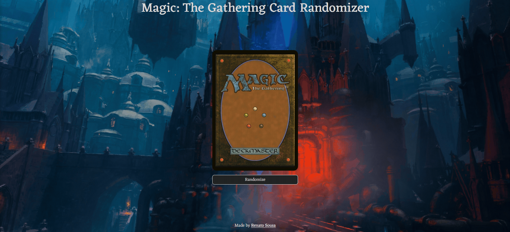

# Magic: The Gathering Card Randomizer

**Link:** https://notare.github.io/magic-the-gathering-card-randomizer

Mostra cartas aleatórias do jogo Magic: The Gathering usando a API do Scryfall

## Como Foi Feito:

**Tecnologias usadas:** HTML, CSS, JavaScript

## Outros Projetos:

**Top Albums Finder:** https://github.com/Notare/top-albums-finder

**Hades - Selecione Seu Personagem:** https://github.com/Notare/hades-select-your-character

**Bia Cabeleireira:** https://github.com/Notare/bia-cabeleireira
