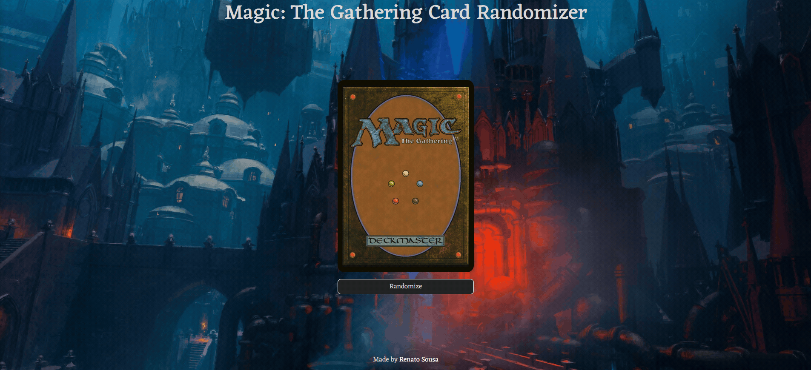

# Magic: The Gathering Card Randomizer

This project allows users to discover random Magic: The Gathering cards with just a click of a button.

**Link to project:**

## How It's Made:

**Tech used:** HTML, CSS, JavaScript

I built this project using the fundamental web technologies: HTML for structuring the content, CSS for styling, and JavaScript to make the page interactive. To enhance the user experience, I integrated the Scryfall API to fetch random Magic: The Gathering cards dynamically.

## Optimizations

During the development process, I realized that the initial version of the website was somewhat basic. To add more interactivity and improve the overall user experience, I implemented a button click animation using CSS. This not only made the website more visually appealing but also increased its engagement.

## Lessons Learned:

Throughout this project, I gained valuable insights into creating an interactive user interface. The process of implementing the button click animation with CSS taught me about the importance of adding subtle visual elements to make the website feel more alive. This experience has fueled my enthusiasm for front-end development and encouraged me to explore more creative ways to enhance user interactions in future projects.

## Other Projects:

**Top Albums Finder:** https://github.com/Notare/top-albums-finder

**Hades - Select Your Character:** https://github.com/Notare/hades-select-your-character

**Bia Cabeleireira (hair salon):** https://github.com/Notare/bia-cabeleireira
